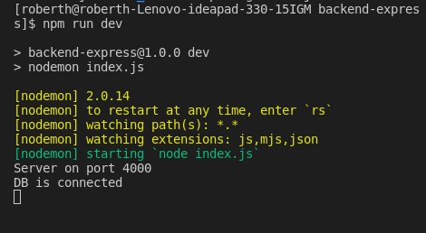
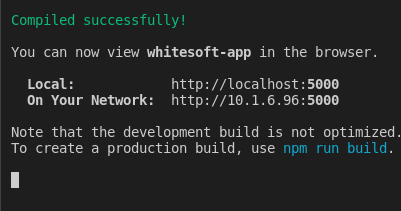
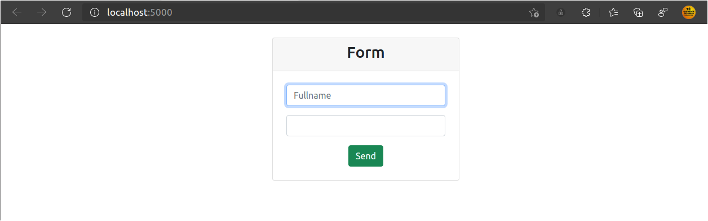
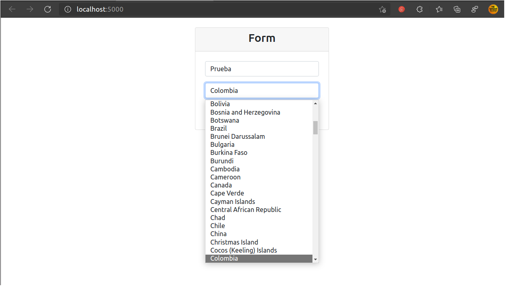
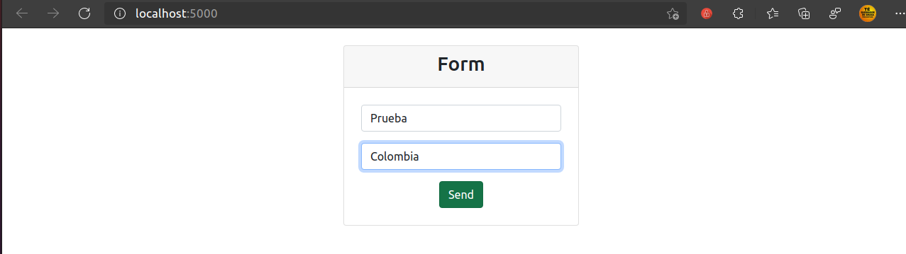
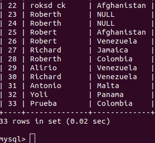
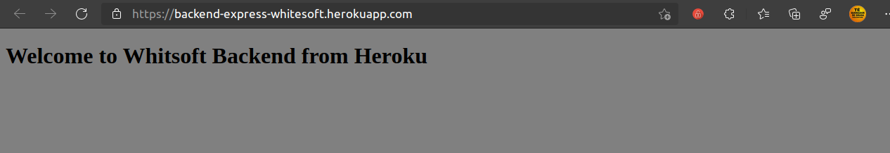
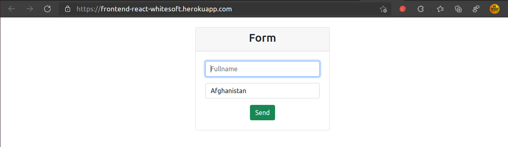

# Getting Started with Create React App
 

Este proyecto fue realizado con Create-React-App. Pero fue adaptado a los requerimientos del cliente, y presentado de forma secilla.

 

## Requerimientos:
 

Nombre completo; este campo es obligatorio
Una lista de selección con países. Los países deben ser obtenidos desde un API.
El formulario va a ser enviado mediante un botón que validara que los campos están diligenciados. Los datos del formulario deben almacenarse en una base de datos. 

<li>Front-end - ReactJs</li>
<li>Back-end - NodeJs</li>

Por favor hacer el host del back-end y front-end en cualquiera de los cloud públicos AWS or Azure or GCP.

El código debe subirse a GitHub y compartir el link.

OK, para este proyecto hemos dejado algunos scripts generados automaticamente por la libreria Create React APP, los cuales están en inglés y son los que siguen a continuación:

## Available Scripts

In the project directory, you can run:

### `npm start`

Runs the app in the development mode.\
Open [http://localhost:5000](http://localhost:5000) to view it in the browser.

The page will reload if you make edits.\
You will also see any lint errors in the console.

### `npm test`

Launches the test runner in the interactive watch mode.\
See the section about [running tests](https://facebook.github.io/create-react-app/docs/running-tests) for more information.

### `npm run build`

Builds the app for production to the `build` folder.\
It correctly bundles React in production mode and optimizes the build for the best performance.

The build is minified and the filenames include the hashes.\
Your app is ready to be deployed!

See the section about [deployment](https://facebook.github.io/create-react-app/docs/deployment) for more information.

### `npm run build` fails to minify

This section has moved here: [https://facebook.github.io/create-react-app/docs/troubleshooting#npm-run-build-fails-to-minify](https://facebook.github.io/create-react-app/docs/troubleshooting#npm-run-build-fails-to-minify)
 

Acá dejamos unas muestra de la aplicación funcionan de manera local en modo desarrllo.

# DEMO Locals

### Inicializando el servidor express backend.
 

 

### Inicializando el servidor react frontend.

 

### Aplicación react frontend. 
 

De acuerdo a los requerimientos dos campos uno con el fullname y el otro una lista desplgable de paises, que se apriviona de la API `http://battuta.medunes.net/api/`. Ambos campos son requeridos para proceder enviar la data al backend

 

### Desplegando la lista de paises
 

 

### Enviando los datos
 

 

### Recibiendo la data en la Base de datos.
 

 
 

### Despleiegue de la Aplicación en Heroku
 

 

